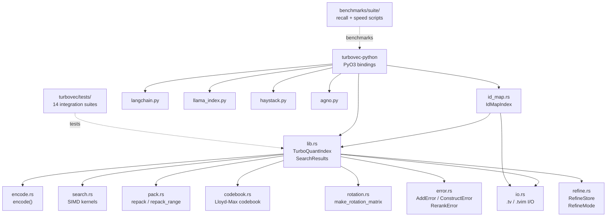
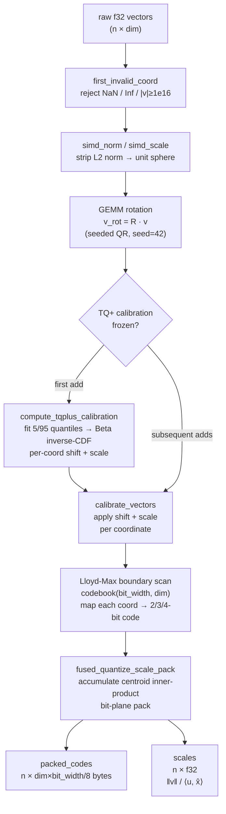
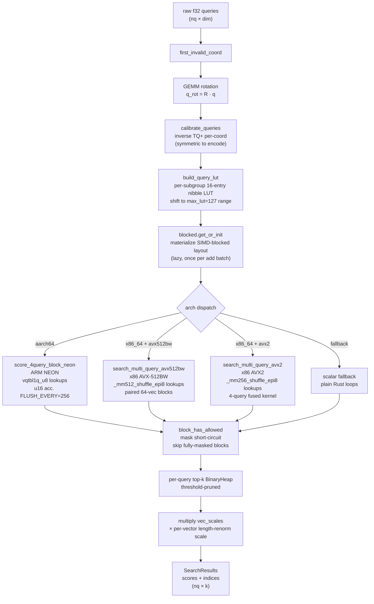

# turbovec Architecture

An educational guide to how the codebase is structured, how vectors flow
through the encode and search pipelines, and how memory is laid out.

---

## 1. Big picture

turbovec implements **TurboQuant**: a data-oblivious vector quantizer that
compresses embeddings to 2–4 bits per coordinate and searches them via
SIMD lookup-table (LUT) scoring — without ever decompressing.

Key properties:
- **No training phase.** The Lloyd-Max quantization boundaries and centroids
  are precomputed analytically from the Beta(α,α) distribution that arises
  after a random rotation. The codebook is a pure function of `(bit_width, dim)`.
- **Data-oblivious.** The same rotation matrix and codebook are used for any
  dataset; TQ+ calibration does a lightweight per-coordinate quantile fit on
  the first batch and reuses it thereafter.
- **Compression.** A 1536-dim float32 vector (6 144 bytes) becomes 96 bytes
  at 2-bit or 192 bytes at 4-bit (16–32× compression for the codes alone;
  add 4 bytes per vector for the per-vector length-renormalization scale).
- **Incremental.** Vectors can be added online; no full-index rebuild is needed.

---

## 2. Module dependency graph



> Solid arrows = compile-time `use` / function calls.
> Dashed = test / benchmark dependencies (not in the published crate graph).

---

## 3. Encode pipeline

This is what happens when you call `index.add(vectors)`.



**Key concepts:**

- **Random rotation** (`rotation.rs`): multiplying by a dense orthogonal matrix
  scrambles the distribution of each coordinate so they are approximately
  i.i.d. Beta(α,α) — the distribution Lloyd-Max was designed for.

- **TQ+ calibration** (`encode.rs:compute_tqplus_calibration`): after rotation,
  each coordinate's empirical 5th and 95th percentiles are matched to the
  theoretical Beta quantiles. This per-coordinate affine transform compensates
  for anisotropy that survives the rotation (e.g. OpenAI embeddings have a
  non-uniform spread per dimension). Fitted once on the first batch, frozen
  for the lifetime of the index.

- **Lloyd-Max quantization** (`codebook.rs`): the optimal uniform scalar
  quantizer for a known distribution. For Beta(α,α) with `α = (dim-1)/2`,
  `codebook(bit_width, dim)` returns the precomputed boundaries (split points)
  and centroids (reconstruction values) for `2^bit_width` levels.

- **Length-renormalization scale** (`scale = ‖v‖ / ⟨u_rot, x̂⟩`): corrects for
  quantization distortion. Multiplying the raw LUT score by this scalar gives
  an unbiased estimate of the true inner product ⟨v, q⟩.

---

## 4. Search pipeline

This is what happens when you call `index.search(queries, k)`.



**LUT scoring without decompression:** instead of reconstructing each vector,
the query is decomposed into per-group contribution tables. For 4-bit codes
each group has 16 entries (hi nibble + lo nibble → two 4-entry sub-tables
packed as one 16-entry `u8` table). The SIMD shuffle instruction (`vqtbl1q_u8`
/ `_mm256_shuffle_epi8`) does 16 lookups per instruction cycle using the code
bytes as indices. Accumulating in `u16` with a flush to `f32` every 256 groups
prevents overflow.

**Rerank (opt-in):** after the coarse scan, `search_with_rerank` rescores the
top `k × rerank_factor` candidates with the `RefineStore` (int8 or f32 originals)
and returns exact top-k. This is the distillation-inspired two-stage pipeline.

---

## 5. Memory layout

### 5a. Bit-plane packed codes

Each encoded vector occupies `dim × bit_width / 8` bytes, stored as `bit_width`
bit-planes of `dim/8` bytes each.

```
Vector layout for dim=8, bit_width=4:
  Plane 0 (LSB): [b0 b1 b2 b3 b4 b5 b6 b7]  ← 1 byte
  Plane 1:       [b0 b1 b2 b3 b4 b5 b6 b7]  ← 1 byte
  Plane 2:       [b0 b1 b2 b3 b4 b5 b6 b7]  ← 1 byte
  Plane 3 (MSB): [b0 b1 b2 b3 b4 b5 b6 b7]  ← 1 byte

Where b_i = (code[i] >> plane) & 1 for coordinate i.
```

All vectors packed contiguously: `packed_codes[v * bytes_per_vec .. (v+1) * bytes_per_vec]`.

### 5b. SIMD-blocked layout

`pack::repack` (or `repack_range` for incremental updates) converts the
bit-plane representation into a SIMD-friendly blocked layout.

Groups of 32 vectors form a **block**. Within each block, all vectors' nibble
bytes for group `g` are contiguous — so a SIMD load fetches one byte from
each of 32 vectors simultaneously.

```
Blocked layout for BLOCK=32:

  block 0:
    group 0: [v0_g0, v1_g0, ..., v31_g0]   32 bytes
    group 1: [v0_g1, v1_g1, ..., v31_g1]   32 bytes
    ...
    group G-1: [...]                        32 bytes

  block 1:
    group 0: [v32_g0, v33_g0, ..., v63_g0]
    ...
```

**x86 perm0-interleaved layout** (FAISS-style): each 32-byte group is further
split into lo-nibbles and hi-nibbles, interleaved via `perm0` for AVX2
cross-lane shuffle compatibility.

**ARM sequential layout**: bytes stored in order, no interleave needed since
NEON `vqtbl1q_u8` operates on 128-bit registers directly.

### 5c. OnceLock lazy caches

`TurboQuantIndex` holds four `OnceLock` fields:

| Cache | Contents | Invalidated by |
|---|---|---|
| `rotation` | dim × dim f32 rotation matrix | Never (pure fn of dim) |
| `boundaries` | Lloyd-Max split points per dim coord | Never (pure fn of bit_width, dim) |
| `centroids` | Lloyd-Max centroids per dim coord | Never (pure fn of bit_width, dim) |
| `blocked` | SIMD-blocked layout of all packed codes | `add` (tail update), `swap_remove` (full reset) |

`search` takes `&self` — safe for concurrent reads once caches are warm.
`add` takes `&mut self` and updates `blocked` incrementally (only dirty tail
blocks are repacked). `swap_remove` fully resets `blocked` since it
reorders vectors.

### 5d. RefineStore (opt-in)

When constructed with `new_with_refine`, an additional `RefineStore` holds
the original input vectors (pre-normalization):
- `Int8` mode: `n × dim` i8 codes + `n` f32 per-vector symmetric scales (`max_abs / 127`).
  Extra memory ≈ `n × (dim + 4)` bytes (d=1536: ≈1.5 KB/vec above the base 192 bytes).
- `Float32` mode: `n × dim` f32 values.
  Extra memory ≈ `n × dim × 4` bytes (d=1536: ≈6 KB/vec).

---

## 6. File format

Both `.tv` (positional index) and `.tvim` (id-map index) share the same core
payload structure.

```
.tv layout:
  [4 bytes]  magic = "TVPI"
  [1 byte]   version (2, 3, or 4)
  ---- core payload ----
  [1 byte]   bit_width
  [4 bytes]  dim (u32 LE)
  [4 bytes]  n_vectors (u32 LE)
  [n × dim × bit_width/8 bytes]  packed_codes
  [n × 4 bytes]  scales (f32 LE)
  [4 bytes]  n_calib (u32 LE)   ← 0 = identity, else = dim
  [n_calib × 4 bytes]  tqplus_shift (f32 LE)
  [n_calib × 4 bytes]  tqplus_scale (f32 LE)
  ---- v4 only: refine trailer ----
  [1 byte]   refine_mode (1=int8, 2=f32)
  if int8:
    [n × 4 bytes]  i8_scales (f32 LE)
    [n × dim bytes]  codes_i8 (i8)
  if float32:
    [n × dim × 4 bytes]  floats (f32 LE)

.tvim layout:
  [4 bytes]  magic = "TVIM"
  [1 byte]   version
  ---- same core payload as .tv ----
  [n × 8 bytes]  slot_to_id (u64 LE)
  ---- v4 only: refine trailer (same as .tv) ----
```

**Version history:**
- v1 (≤ 0.4.3): no magic, bare bit_width byte. Refused with a rebuild hint.
- v2 (0.4.4–0.5.x): added magic + version. TQ+ absent; loads as identity calibration.
- v3 (0.6.x+): adds TQ+ calibration trailer.
- v4: adds optional refine-store trailer (written only when `RefineStore` is present).
  Default (no refine) indexes continue to write v3.

---

## 7. LLM concepts mapped to turbovec

| LLM technique | turbovec equivalent |
|---|---|
| **Weight quantization** (LLM INT8/INT4) | `pack.rs` bit-plane encoding (Lloyd-Max 2–4 bit per coordinate) |
| **Activation quantization** (KV-cache INT8) | `RefineStore::Int8` — per-vector symmetric scale, same math as `q8_0` in llama.cpp |
| **Distillation / re-ranking** | `search_with_rerank`: coarse 2-bit "student" retrieves candidates; 8-bit/f32 "teacher" rescores for exact top-k |
| **PagedAttention** (vLLM block tables) | `pack.rs:repack_range`: blocked layout at BLOCK=32 granularity; `add` only recomputes dirty tail blocks instead of the full O(n) repack |
| **KV-cache memory reduction** | Using 2-bit codes vs 4-bit halves the code storage; `RefineStore::Int8` trades 75% accuracy accuracy for 4× decode-time fidelity |
| **Kernel-level tuning** | `search.rs` hand-written SIMD kernels (NEON / AVX2 / AVX-512BW), `max_lut=127` scaling, `FLUSH_EVERY=256` u16 overflow prevention |

See `examples/paged-llm-demo/` for a hands-on toy transformer that demonstrates
PagedAttention block tables and INT8 KV quantization in isolation.
